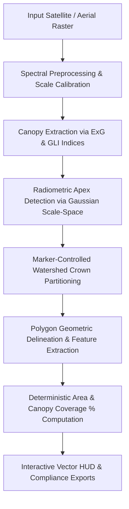

# ForestVision AI - Remote Sensing & Computer Vision Methodology

## Overview
ForestVision AI is an institutional-grade canopy intelligence platform engineered to detect individual tree crowns, segment horizontal canopy boundaries, and compute deterministic vegetation coverage indices from high-resolution satellite orthophotos and UAV aerial rasters.

---

## Computer Vision Pipeline

### 1. Multispectral Canopy Extraction
Photosynthetic vegetation is isolated from bare soil, paved paths, rocks, and water using complementary chromatic and spectral indices:
- **Excess Green Index ($ExG$)**:
  $$ExG = 2 \cdot G - R - B$$
- **Green Leaf Index ($GLI$)**:
  $$GLI = \frac{2 \cdot G - R - B}{2 \cdot G + R + B + \epsilon}$$
- **HSV Chromatic Spectrum Filtering**: Evergreen and deciduous foliage hues ($24^\circ \le H \le 96^\circ$) are filtered with value thresholds to eliminate extreme shadow occlusions.
- **Adaptive Otsu Thresholding & Morphology**: Combined binary mask is filtered with morphological opening ($\text{kernel}=3\times3$) to suppress speckle noise and morphological closing ($\text{kernel}=5\times5$) to bridge intra-crown leaf gaps.

### 2. Radiometric Peak & Treetop Apex Detection
Tree crowns exhibit maximum solar reflectance and biomass concentration at their apex (treetop). We compute an illumination-spectral response map:
$$R(x, y) = 0.4 \cdot I_{\text{gray}}(x, y) + 0.6 \cdot \text{ExG}_{\text{norm}}(x, y)$$
A multi-scale Gaussian smoothing filter is applied ($\sigma = 1.5$) followed by a non-maximum suppression spatial filter ($f_{\text{size}} \ge 5\text{px}$) to identify distinct treetop seeds.

### 3. Marker-Controlled Watershed Segmentation
Continuous forest canopy is partitioned into individual, non-overlapping crowns using marker-controlled watershed flooding:
- Background marker ($L=1$) is derived from dilated non-forest open ground.
- Foreground markers ($L \in [2, N+1]$) are assigned to individual treetop apexes.
- Flooding along the morphological gradient partitions adjacent and interlocking crowns along natural topographic and reflectance saddles.

### 4. Polygon Geometry & Feature Extraction
- Boundaries for each crown label segment are extracted using contour topological tracking.
- Contours are simplified using the **Douglas-Peucker algorithm** ($\epsilon = 0.02 \times \text{perimeter}$) to generate lightweight vector coordinates for interactive web canvas inspection.
- Individual crown attributes computed:
  - Equivalent circular radius: $r = \sqrt{\frac{\text{Area}}{\pi}}$
  - Area: $\text{pixels} \times \text{GSD}^2 \text{ m}^2$ (or $\text{px}^2$)
  - Spectral confidence score based on greenness saturation and circularity:
    $$C = 4\pi \frac{\text{Area}}{\text{Perimeter}^2}$$

---

## Geospatial Scale & Deterministic Metrics

| Metric | Formula | Unit |
| :--- | :--- | :--- |
| **Trees Detected** | Count of valid partitioned crown segments | Count |
| **Estimated Canopy Area** | $\sum_{i=1}^N \text{Crown Area}_i$ | $m^2$ or $px^2$ |
| **Area Analyzed** | $\text{Image Width} \times \text{Image Height} \times \text{GSD}^2$ | $m^2$ or $px^2$ |
| **Canopy Coverage** | $\frac{\text{Estimated Canopy Area}}{\text{Area Analyzed}} \times 100\%$ | $\%$ |
| **Stem Density** | $\frac{\text{Trees Detected}}{\text{Analyzed Area (ha)}}$ | stems/ha |

---

## Methodological Limitations & Transparency
1. **Sensor Resolution & GSD**: Ground Sampling Distance determines the minimum detectable tree size. Sub-pixel crowns under $1.5\text{m}$ in low-resolution imagery may be aggregated into larger clusters.
2. **Dense Overlapping Stands**: In ultra-dense tropical rainforests, super-canopy trees may occlude understory saplings.
3. **Shadow Artifacts**: Steep terrain relief creates radiometric shadowing. Detections in deep shadows are flagged as `Uncertain` in the telemetry HUD.
4. **Scale Calibration**: When uncalibrated standard JPG/PNG images lack GeoTIFF metadata, metrics are explicitly identified as image-space pixels ($px^2$) to avoid fabricating physical measurements.
